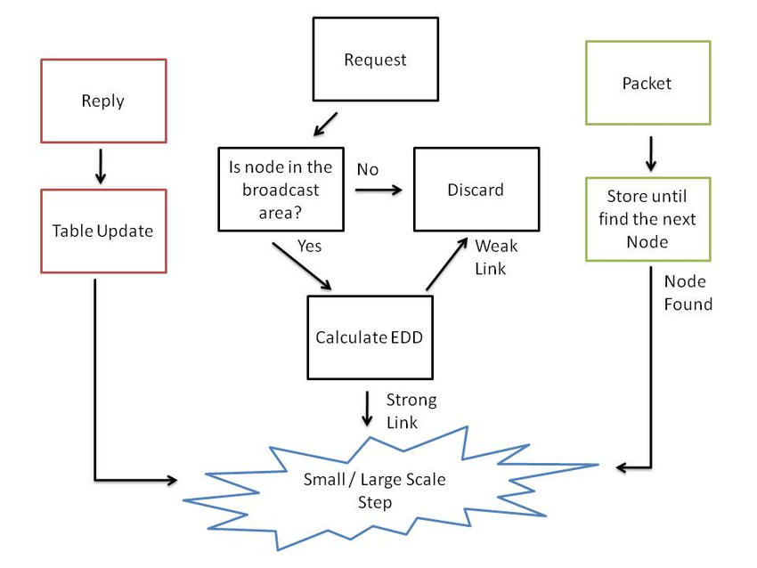

# Dynamic Routing

    Nama		: Yasir Maarif
    NRP		: 3122600013
    Kelas		: 2 D4 Teknik Informatika
    Mata Kuliah	: Konsep Jaringan
    Dosen Pengampu	: Dr. Ferry Astika Saputra ST, M.Sc

    
    
<strong>Gambar:</strong> Dynamic routing step

Jaringan komputer adalah komponen vital dalam dunia modern yang terhubung secara global. Dalam konteks jaringan komputer, routing adalah proses yang sangat penting. Routing adalah metode yang digunakan untuk mengirim data dari satu titik ke titik lain dalam jaringan, yang dapat mencakup jaringan lokal, jaringan global, atau bahkan Internet. Salah satu jenis routing yang penting dalam dunia jaringan adalah dynamic routing.

Routing dynamic adalah routing yang dilakukan oleh router dengan cara membuat jalur  komunikasi data secara otomatis sesuai dengan pengaturan yang dibuat. Jika ada  perubahan topologi di dalam jaringan, maka router akan otomatis membuat jalur  routing yang baru. Routing dynamic ini lebih mudah dilakukan daripada menggunakan  routing static dan default. 

Routing dynamic ini berada pada lapisan network layer jaringan komputer dalam  TCP/IP Protocol Suites. Routing dynamic juga merupakan routing protocol yang  digunakan untuk menemukan network serta untuk melakukan update routing table pada  router. Meskipun begitu, routing jenis ini terdapat perbedaan dalam pemrosesan data di  CPU router dan penggunaan bandwith dari link jaringan. 

Cara kerja routing dynamic yaitu Protokol Routing mengatur tiap Router sehingga  dapat berkomunikasi antar Router satu dengan Router lainnya dan saling memberikan  informasi dan juga tentunya informasi Routing yang dapat mengubah isi dari routing  table, dengan kata lain Dynamic Routing adalah proses pengisian data pada Routing  table secara otomatis. Secara khusus, dynamic routing merupakan jenis routing yang  paling mudah dikonfigurasikan dan lebih efektif dalam memiliki rute terbaik untuk  sebuah tujuan jaringan serta dapat menemukan jaringan terluar.

Dynamic routing memiliki beberapa manfaat penting dalam konteks jaringan komputer:

1. Skalabilitas: Dynamic routing memungkinkan jaringan untuk tumbuh dan berubah dengan mudah tanpa perlu konfigurasi manual yang rumit. Ini sangat penting dalam jaringan yang berkembang pesat.

2. Redundansi: Dynamic routing dapat menciptakan rute alternatif ketika rute utama tidak tersedia. Ini meningkatkan keandalan jaringan dan mengurangi waktu downtime.

3. Efisiensi: Dynamic routing memungkinkan perangkat jaringan untuk memilih rute terbaik berdasarkan parameter seperti jarak, kecepatan, atau beban. Ini memastikan pengiriman data yang lebih efisien.

4. Fleksibilitas: Dynamic routing memungkinkan jaringan untuk beradaptasi dengan perubahan topologi tanpa campur tangan manusia. Ini mengurangi kesalahan konfigurasi manusia dan menghemat waktu.

Beberapa contoh protokol dynamic routing yang umum digunakan dalam jaringan komputer termasuk:

1. RIP (Routing Information Protocol): Protokol ini digunakan dalam jaringan kecil hingga menengah dan bekerja berdasarkan jumlah lompatan antara router.

2. IGRP (Interior Gateway Routing Protocol): sebuah routing protocol yang dikembangkan pada pertengahan tahun 1980-an oleh Cisco Systems Inc. Tujuan utama penciptaan IGRP adalah untuk menyediakan protokol yang kuat untuk routing dalam sistem otonomi. IGRP menggunakan bandwith dan garis menunda secara default untuk menentukan rute terbaik dalam sebuah internetwork (Composite Metrik).

3. OSPF (Open Shortest Path First): Protokol ini lebih canggih dan cocok untuk jaringan yang lebih besar. Ia menggunakan algoritma Dijkstra untuk menentukan rute terbaik.

4. EIGRP (Enhanced Interior Gateway Routing Protocol): Protokol routing ini menggunakan algoritma advanced distance vector dan menggunakan cost load balancing yang tidak sama. Algoritma yang dipakai adalah kombinasi antara distance vector dan link-state, serta menggunakan Diffusing.

5. BGP (Border Gateway Protocol): Sebagai routing protocol, BGP memiliki kemampuan untuk melakukan pengumpulan rute, pertukaran rute dan menentukan rute terbaik menuju ke sebuah lokasi dalam sebuah jaringan. Yang membedakan BGP dengan routing protocol lain adalah BGP termasuk ke dalam kategori routing protocol jenis Exterior Gateway Protocol (EGP). BGP merupakan “distance vector exterior gateway protocol” yang bekerja secara cerdas untuk merawat path-path ke jaringan lainnya.
