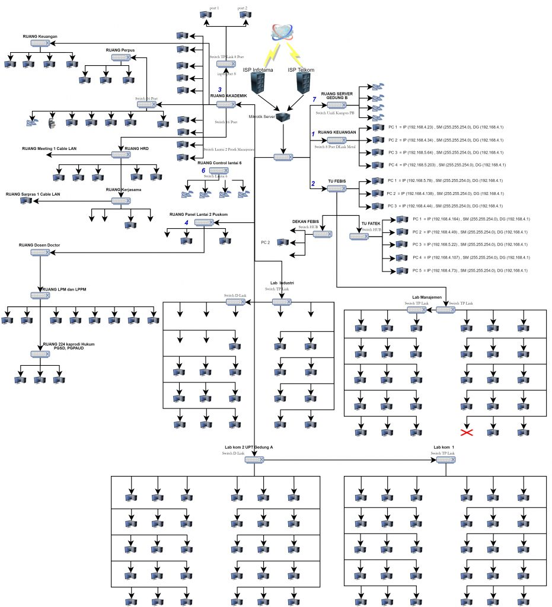

# ARISTEKTUR JARINGAN KAMPUS

    Nama		: Yasir Maarif
    NRP		: 3122600013
    Kelas		: 2 D4 Teknik Informatika
    Mata Kuliah	: Konsep Jaringan
    Dosen Pengampu	: Dr. Ferry Astika Saputra ST, M.Sc

## Arsitektur Jaringan

Arsitektur jaringan kampus adalah struktur dan desain jaringan komputer yang digunakan di lingkungan kampus atau universitas. Arsitektur ini dirancang untuk menghubungkan berbagai bangunan, gedung, ruang kelas, laboratorium, perpustakaan, dan fasilitas lainnya di dalam kampus agar dapat saling terhubung dan berkomunikasi dengan baik.

**Beberapa komponen umum dari arsitektur jaringan kampus termasuk:**

1. Backbone Network: Jaringan tulang punggung (backbone) yang merupakan jalur utama atau tulang belakang dari jaringan. Ini menghubungkan berbagai bagian kampus dan sering kali menggunakan teknologi jaringan canggih seperti serat optik untuk mentransfer data dengan kecepatan tinggi.

2. Access Network: Bagian dari jaringan yang menghubungkan perangkat-perangkat akhir seperti komputer, laptop, printer, dan perangkat mobile ke jaringan. Ini dapat mencakup jaringan nirkabel (Wi-Fi) dan kabel (Ethernet) di ruang kelas, perpustakaan, dan area umum lainnya di kampus.

3. Perangkat Jaringan: Switches, router, access points, firewall, dan perangkat jaringan lainnya yang digunakan untuk mengarahkan dan mengontrol lalu lintas data di jaringan.

4. Keamanan Jaringan: Sistem keamanan seperti firewall, enkripsi data, sistem deteksi intrusi, serta kebijakan keamanan yang diterapkan untuk melindungi jaringan dari serangan cyber dan akses yang tidak sah.

5. Layanan Jaringan: Layanan seperti email, akses internet, penyimpanan data, aplikasi kampus, dan sistem manajemen pembelajaran (LMS) yang disediakan kepada mahasiswa, dosen, dan staf.

6. Redundansi dan Cadangan: Implementasi sistem cadangan dan redundansi untuk memastikan ketersediaan jaringan yang tinggi. Hal ini termasuk penggunaan sumber daya cadangan (misalnya, jalur komunikasi ganda) untuk mengatasi kegagalan yang mungkin terjadi pada jaringan utama.

7. Skalabilitas: Desain jaringan yang dapat diperluas dan dikembangkan seiring dengan pertumbuhan kebutuhan pengguna, baik dari segi jumlah perangkat yang terhubung maupun volume data yang ditangani.

## Contoh Topologi Jaringan

    

